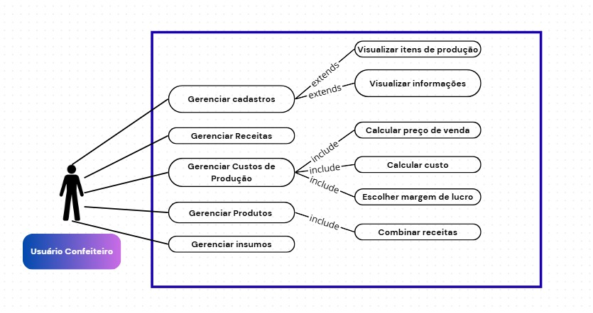

# Especificações do Projeto

## Personas

**Persona 1 – Mariana Oliveira (Confeiteira Autônoma Iniciante)**
- **Idade:** 23 anos
- **Profissão:** Estudante de gastronomia 
- **Contexto:** Mariana começou a vender doces durante a faculdade para complementar a renda. Trabalha de casa, recebe encomendas pelo WhatsApp e Instagram, mas ainda tem dificuldade em organizar os pedidos e calcular preços de forma justa.
- **Necessidades:**
  - Não sabe precificar corretamente seus doces.
  - Se perde com as encomendas, às vezes esquece prazos.
  - Quer transmitir mais profissionalismo para os clientes.
- **Como o Sweetify ajuda:**
  - Automatiza o cálculo de preços com base nos custos e margem de lucro.
  - Traz maneiras de organizar a produção.

**Persona 2 – Carlos Mendes (Confeiteiro Experiente e Empreendedor)**
- **Idade:** 35 anos
- **Profissão:** Dono de uma pequena confeitaria de bairro
- **Contexto:** Carlos já vive da confeitaria há anos, mas gerencia tudo em cadernos e planilhas. Quer expandir o negócio, atender mais clientes e evitar erros na produção, mas tem dificuldade em ter um controle eficiente dos ingredientes e da produção.
- **Necessidades/Dores:**
  - Precisa de controle sobre os ingredientes para evitar desperdícios.
  - Quer facilitar o gerenciamento de muitos pedidos ao mesmo tempo.
- **Como o Sweetify ajuda:**
  - Mostra a quantidade exata de ingredientes para cada produção.
  - Ajuda a gerenciar insumos, embalagens e outros itens necessários para um produto
  - Permite atualizar receitas e preços facilmente.

**Persona 3 – Juliana Santos (Gerente de capital humano)**
- **Idade:** 29 anos
- **Profissão:** Gerente de capital humano
- **Contexto:** Juliana é mãe solo de três filhos e possui um emprego formal em uma pequena empresa. Com o aumento do custo de itens básicos para a sua subsistência, resolveu começar há trabalhar com doces fora do seu expediente para complementar sua renda. Pela falta de tempo no dia a dia e pouca experiência com o mercado e processos produtivos, Juliana acaba se perdendo e dispendendo muito tempo em tarefas básicas do mundo da confeitaria.
- **Necessidades/Dores:**
  - Formas de gerenciar suas receitas.
  - Jeitos práticos de saber o que será necessário para produzir um pedido
  - Realização manual de muitos processos
 - **Como o Sweetify ajuda:**
  - Permite cadastrar e gerenciar receitas, insumos e produtos em um mesmo local de forma rápida e integrada
  - Dá clareza sobre o que será necessário para produzir um pedido.
  - Automatiza processos manuais

## Histórias de Usuários

|EU COMO... `PERSONA`| QUERO/PRECISO ... `FUNCIONALIDADE` |PARA ... `MOTIVO/VALOR`                 |
|--------------------|------------------------------------|----------------------------------------|
| Confeiteiro | Cadastrar minhas informações pessoais e meus itens de produção | Organizar minhas receitas e pedidos de forma prática |
| Confeiteiro | Cadastrar os preços dos ingredientes que uso | Calcular os valores das encomendas |
| Confeiteiro | Que o sistema calcule e recalcule o preço de venda de um produto | Garantir que estou lucrando de forma justa e transparente |
| Confeiteiro | Inserir a margem de lucro de cada produto que cadastrar | Gerenciar meus preços de venda adequadamente |
| Confeiteiro | Visualizar todos os produtos | Conseguir organizar minha rotina de produção |
| Confeiteiro | Ver a lista de ingredientes necessários para cada produto | saber exatamente as quantidade e me organizar para comprar os insumos e itens usados na produção |
| Confeiteiro | Combinar receitas em um único produto | Ter um diferentes combinações entre minhas receitas |
| Confeiteiro | Registrar receitas utilizando somente insumos pré-cadastrados | Manter a organização e a coerência dos meus produtos. |

## Requisitos

### Requisitos Funcionais

|ID    | Descrição do Requisito |Teste | Critério | Prioridade | Origem
|------|-----------------------------------------|---|------------------------------------------|---|
|RF-001|UC-001 - O sistema deve permitir que o usuário faça login com email e senha|TC-001 - Teste de autenticação | O usuário consegue acessar o sistema com credenciais válidas | Alta | Cliente |
|RF-002|UC-002 - O sistema deve permitir gerenciamento de usuários, produtos, receitas e custos de produção |TC-002 - Teste de CRUD de dados | O usuário consegue criar, atualizar e excluir dados | Alta | Cliente |
|RF-003|UC-003 - O sistema deve ser capaz de calcular rendimento total de um produto | TC-003 - Teste de cálculo de rendimento | O sistema exibe o número total de porções ou unidades que a receita rende | Alta | Cliente |
|RF-004|UC-004 - O sistema deve permitir o cadastro produto com múltiplas receitas | TC-004 - Teste de associação de receitas | O usuário consegue vincular várias receitas a um único produto | Alta | Cliente |
|RF-005|UC-005 - O sistema deve ser capaz de gerenciar receitas | TC-005 - Teste de criação e edição de receitas | O usuário consegue criar, salvar, exlcuir e alterar receitas existentes | Alta | Cliente |
|RF-006|UC-006 - O sistema deve ser capaz de sugerir preços de produtos |TC-006 - Teste de precificação automática | Sugestões de preços apresentadas com base em dados de insumos e receitas inseridos pelo usuário | Alta | Cliente |
|RF-007|UC-007 - O sistema deve permitir o controle de insumos |TC-007 - Teste de criação e edição de insumos | O usuário consegue criar, salvar e alterar receitas existentes | Alta | Cliente |
|RF-008|UC-008 - O sistema deve permitir que o usuário visualize todas as informações que cadastrou na aplicação | TC-008 - Teste de visualização de dados | O usuário pode visualizar a lista completa de produtos, receitas, e custos | Alta | Cliente |

### Requisitos não Funcionais

|ID     | Descrição do Requisito  | Tipo |
|-------|-------------------------|----|
|RNF-001|O sistema deve seguir as regras de privacidade LGPD.|Segurança|Dados do usuário tratados de acordo com a legislação vigente.|
|RNF-002|O sistema deve ser responsivo.|Usabilidade|Interface se adapta a dispositivos móveis, tablets e desktops.|
|RNF-003|O sistema deve estar disponível 24/7.|Disponibilidade|Testes confirmam uptime contínuo.|
|RNF-004|Tempo de carregamento menor que 3 segundos.|Desempenho|Páginas principais carregam em até 3 segundos em ambiente de produção.|
 

## Restrições

|ID| Restrição                                             |
|--|-------------------------------------------------------|
|RN-01|Senhas devem ter no mínimo 8 caracteres, incluindo letras e números.|
|RN-02|Sistema deve ser desenvolvido dentro do prazo estipulado para o projeto.|

## Diagrama de Casos de Uso

# Gerenciamento de Projeto

Todo o gerenciamento do projeto será feito através do worksplace do [Sweetify no Clickup](https://app.clickup.com/90132328478/v/li/901319034147).

Somente o [planejamento de custos](img/02-orcamento.png](https://docs.google.com/spreadsheets/d/1Kk22LDt9Ccu2w5gTrt0UidkCqqAYLPMlzvw2s77rH5c/edit?usp=sharing)) foi feito em outra plataforma (Google Sheets)
