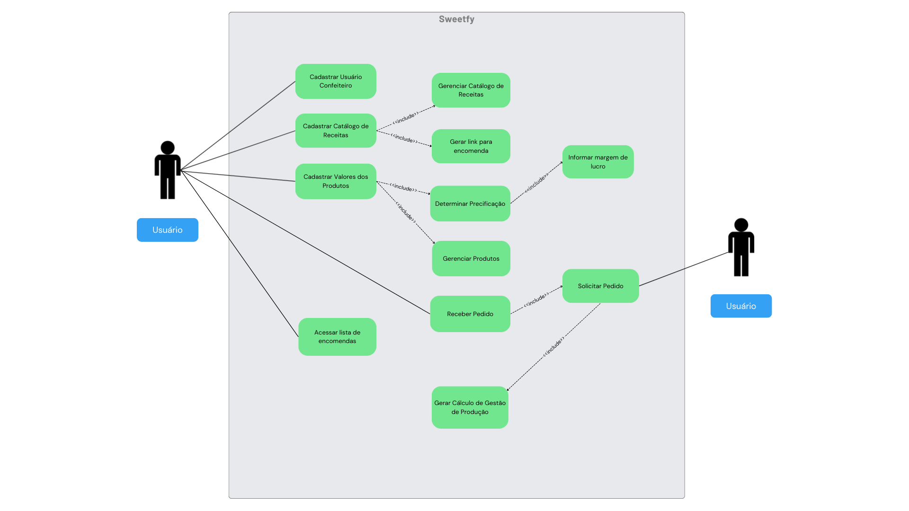

# Especificações do Projeto

## Personas

**Persona 1 – Mariana Oliveira (Confeiteira Autônoma Iniciante)**
- **Idade:** 23 anos
- **Profissão:** Estudante de gastronomia 
- **Contexto:** Mariana começou a vender doces durante a faculdade para complementar a renda. Trabalha de casa, recebe encomendas pelo WhatsApp e Instagram, mas ainda tem dificuldade em organizar os pedidos e calcular preços de forma justa.
- **Necessidades:**
  - Não sabe precificar corretamente seus doces.
  - Se perde com as encomendas, às vezes esquece prazos.
  - Quer transmitir mais profissionalismo para os clientes.
- **Como o Sweetify ajuda:**
  - Automatiza o cálculo de preços com base nos custos e margem de lucro.
  - Organiza os pedidos por ordem de entrega.
  - Gera um catálogo bonito e compartilhável para enviar aos clientes.

**Persona 2 – Carlos Mendes (Confeiteiro Experiente e Empreendedor)**
- **Idade:** 35 anos
- **Profissão:** Dono de uma pequena confeitaria de bairro
- **Contexto:** Carlos já vive da confeitaria há anos, mas gerencia tudo em cadernos e planilhas. Quer expandir o negócio, atender mais clientes e evitar erros na produção, mas tem dificuldade em ter um controle eficiente dos ingredientes e da produção.
- **Necessidades/Dores:**
  - Precisa de controle sobre os ingredientes para evitar desperdícios.
  - Quer facilitar o gerenciamento de muitos pedidos ao mesmo tempo.
  - Precisa manter seu catálogo sempre atualizado de forma rápida.
- **Como o Sweetify ajuda:**
  - Mostra a quantidade exata de ingredientes para cada produção.
  - Ajuda a acompanhar pedidos em andamento e já concluídos.
  - Permite atualizar receitas e preços facilmente.

**Persona 3 – Juliana Santos (Cliente de Doces)**
- **Idade:** 29 anos
- **Profissão:** Analista de Marketing
- **Contexto:** Juliana adora encomendar doces para festas de amigos e eventos da família. Costuma buscar opções em redes sociais, mas muitas vezes se sente perdida porque os catálogos não são claros e os preços variam muito.
- **Necessidades/Dores:**
  - Quer visualizar facilmente as opções de doces e preços.
  - Deseja praticidade na hora de encomendar.
  - Gosta de ter segurança de que o pedido será entregue no prazo.
 - **Como o Sweetify ajuda:**
  - Disponibiliza um catálogo online organizado e confiável.
  - Dá clareza sobre preços e produtos disponíveis.
  - Aumenta a confiança no trabalho do confeiteiro.

## Histórias de Usuários

|EU COMO... `PERSONA`| QUERO/PRECISO ... `FUNCIONALIDADE` |PARA ... `MOTIVO/VALOR`                 |
|--------------------|------------------------------------|----------------------------------------|
| Confeiteiro | Cadastrar minhas informações pessoais e meus itens de produção | Organizar minhas receitas e pedidos de forma prática |
| Confeiteiro | Cadastrar os preços dos ingredientes que uso | Calcular os valores das encomendas |
| Confeiteiro | Que o sistema calcule e recalcule o preço de venda de um produto | Garantir que estou lucrando de forma justa e transparente |
| Confeiteiro | Inserir a margem de lucro de cada produto que cadastrar | Gerenciar meus preços de venda adequadamente |
| Confeiteiro | Visualizar todos os produtos | Conseguir organizar minha rotina de produção |
| Confeiteiro | Ver a lista de ingredientes necessários para cada produto | saber exatamente as quantidade e me organizar para comprar os insumos e itens usados na produção |
| Confeiteiro | Combinar receitas em um único produto | Ter um diferentes combinações entre minhas receitas |
| Confeiteiro | Registrar receitas utilizando somente insumos pré-cadastrados | Manter a organização e a coerência dos meus produtos. |

## Requisitos

### Requisitos Funcionais

|ID|Descrição do Requisito|Prioridade|Critério de Aceitação|Origem|
|---|---|---|---|---|
|RF-001|O sistema deve permitir login com e-mail e senha.|Alta|O usuário consegue acessar o sistema com credenciais válidas.|Cliente|
|RF-002|O sistema deve permitir que o usuário adicione seu catálogo de produtos.|Alta|O usuário consegue cadastrar produtos com nome, descrição, preço e imagens.|Cliente|
|RF-003|O usuário terá a possibilidade de acessar todas as encomendas, contendo nome do cliente, produto, quantidade e prazo de entrega.|Alta|Listagem completa de encomendas com os campos definidos.|Cliente|
|RF-004|O usuário terá acesso aos pedidos por ordem de prioridade, de acordo com o prazo de entrega determinado pelos clientes.|Alta|Pedidos exibidos em ordem de prazo crescente.|Cliente|
|RF-005|No catálogo, o usuário pode adicionar novas receitas ou editar informações de receitas já cadastradas, mantendo o cardápio atualizado.|Média|O usuário consegue criar, salvar e alterar receitas existentes.|Cliente|
|RF-006|O sistema deve sugerir precificação aos catálogos dos clientes baseado nos preços de mercado.|Baixa|Sugestões de preços apresentadas com base em dados externos ou históricos.|Cliente|
|RF-007|O sistema deve fazer um controle automático de estoque e uso de ingredientes na confecção dos doces baseado nos pedidos.|Alta|O estoque é atualizado automaticamente após cada pedido confirmado.|Cliente|
|RF-008|O sistema deve oferecer ao usuário relatórios pré-definidos como curva ABC e margem de lucros.|Média|Relatórios são gerados corretamente e exibem dados consolidados.|Cliente|

### Requisitos não Funcionais

|ID     | Descrição do Requisito  | Tipo |
|-------|-------------------------|----|
|RNF-001|O sistema deve seguir as regras de privacidade LGPD.|Segurança|Dados do usuário tratados de acordo com a legislação vigente.|
|RNF-002|O sistema deve ser responsivo.|Usabilidade|Interface se adapta a dispositivos móveis, tablets e desktops.|
|RNF-003|O sistema deve estar disponível 24/7.|Disponibilidade|Testes confirmam uptime contínuo.|
|RNF-004|Tempo de carregamento menor que 3 segundos.|Desempenho|Páginas principais carregam em até 3 segundos em ambiente de produção.|
 

## Restrições

|ID| Restrição                                             |
|--|-------------------------------------------------------|
|RN-01|Senhas devem ter no mínimo 8 caracteres, incluindo letras e números.|
|RN-02|Relatórios só podem ser gerados por usuários com perfil de administrador.|

## Diagrama de Casos de Uso

# Matriz de Rastreabilidade

|ID    | Descrição do Requisito |Teste | Critério | Prioridade |
|------|-----------------------------------------|---|------------------------------------------|---|
|RF-001|UC-001 - Login no Sistema|TC-001 - Teste de autenticação| O usuário consegue acessar o sistema com credenciais válidas.| Alta |
|RF-002|UC-002 - Cadastro de Catálogo|TC-002 - Teste de cadastro de produtos| O usuário consegue cadastrar produtos com nome, descrição, preço e imagens.| Alta |
|RF-003|UC-003 - Listar Encomendas|TC-003 - Teste de listagem de encomendas| Listagem completa de encomendas com os campos definidos.| Média |
|RF-004|UC-004 - Priorizar Pedidos|TC-004 - Teste de ordenação por prazo| Pedidos exibidos em ordem de prazo crescente.| Média |
|RF-005|UC-005 - Gerenciar Receitas|TC-005 - Teste de criação e edição de receitas| O usuário consegue criar, salvar e alterar receitas existentes.| Alta |
|RF-006|UC-006 - Sugestão de Preços|TC-006 - Teste de precificação automática| Sugestões de preços apresentadas com base em dados externos ou históricos.| Média |
|RF-007|UC-007 - Controle de Estoque|TC-007 - Teste de atualização automática do estoque| O estoque é atualizado automaticamente após cada pedido confirmado.| Baixa |
|RF-008|UC-008 - Relatórios Financeiros|TC-008 - Teste de geração de relatórios| Relatórios são gerados corretamente e exibem dados consolidados.| Média |

# Gerenciamento de Projeto

Todo o gerenciamento do projeto será feito através do worksplace do [Sweetify no Clickup](https://app.clickup.com/90132328478/v/li/901319034147).

Somente o [planejamento de custos](img/02-orcamento.png](https://docs.google.com/spreadsheets/d/1Kk22LDt9Ccu2w5gTrt0UidkCqqAYLPMlzvw2s77rH5c/edit?usp=sharing)) foi feito em outra plataforma (Google Sheets)
