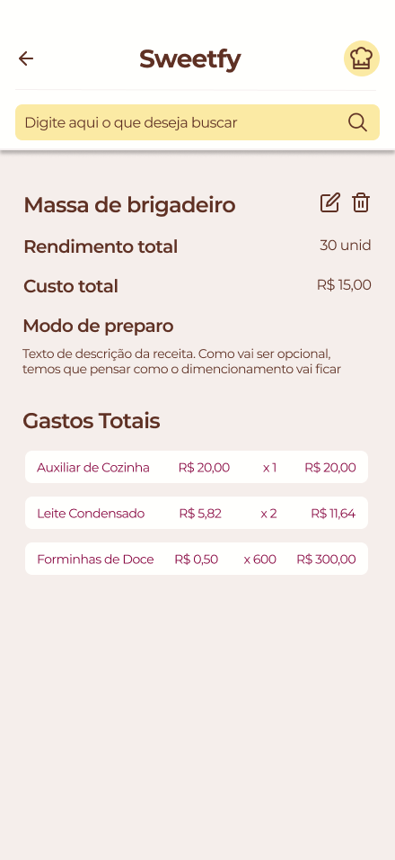

# Projeto de Interface

Nesta seção apresentamos a interface principal do nosso aplicativo Sweetify.

## Diagrama de Fluxo

Abaixo apresentamos o fluxo do usuário através do diagrama UML de atividades.
Além do diagrama, é possível acessar o link disponibilizado abaixo, para acessar o protótipo interativo.
https://www.figma.com/proto/uLLw7vcthNawTnznk07h7g/Sweetfy?node-id=1-2&t=RVopL5oIHCDj0uFF-1

## Wireframes

### Splash Screen

### Login e Cadastro

### Cadastro de itens

### HomePage

### Itens cadastrados

### Detalhamento Item

