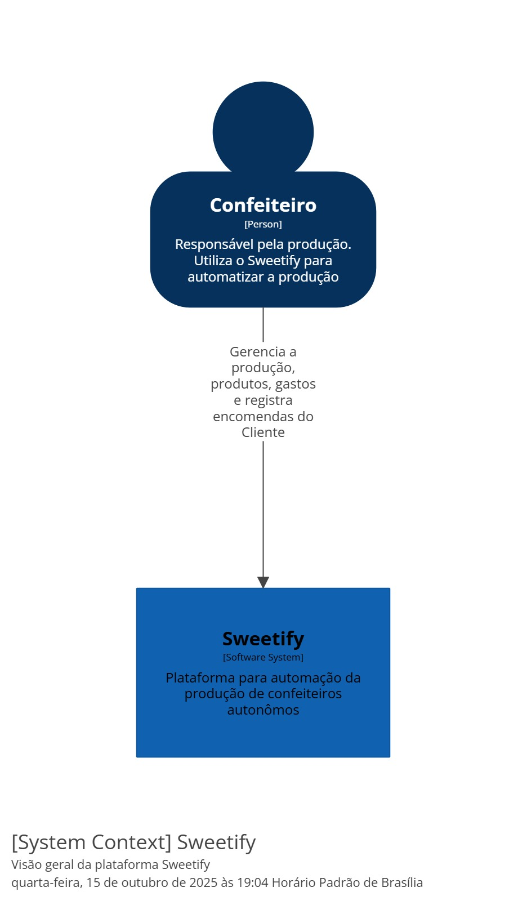
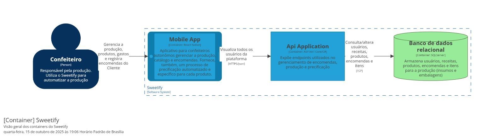
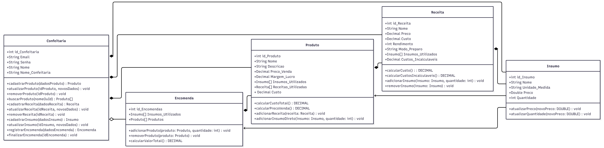
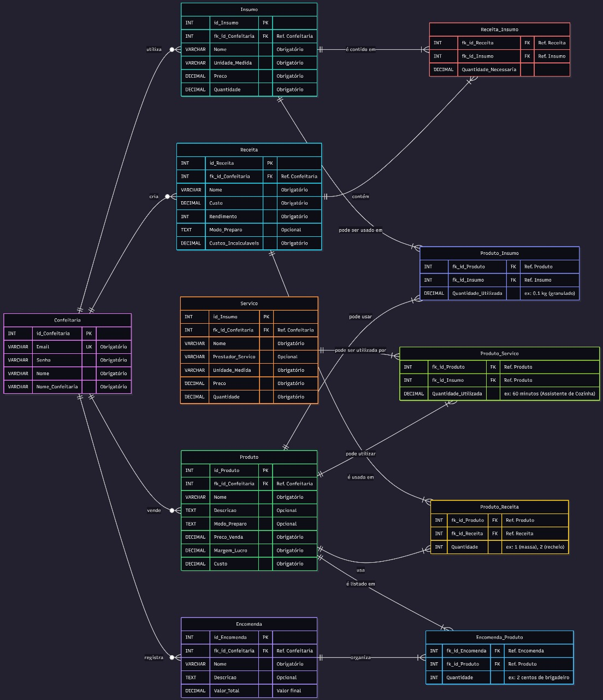

# Arquitetura da Solução

Pré-requisitos: <a href="3-Projeto de Interface.md"> Projeto de Interface</a>

Optamos por utilizar o Modelo C4 para descrever a arquitetura do nosso sistema, fornecendo visões detalhadas nos níveis de Contexto e Container.

### Nível de Contexto

Esta seção apresenta a visão geral do nosso sistema.

O Aplicativo Sweetify é utilizado pelo Usuário (Confeiteiro). O principal objetivo do sistema é automatizar e simplificar dois processos críticos para o usuário: a gestão da produção e o processo de precificação de produtos de confeitaria.

### Nível de Container

A visão de Container detalha a arquitetura interna do nosso aplicativo, mostrando as principais aplicações e armazenamentos de dados que compõem o sistema. O Usuário interage diretamente com a Interface de Usuário (Mobile App), que será desenvolvida utilizando React Native. Esta interface, por sua vez, se comunica com a API de Backend. A API é o componente responsável por toda a lógica de negócio e pelo gerenciamento do acesso aos dados, sendo desenvolvida em C# com o framework ASP.NET Core. Complementando o backend, o Banco de Dados é responsável por persistir e armazenar todas as informações críticas da aplicação. A comunicação e o gerenciamento dos dados do banco são feitos exclusivamente pela API.

## Diagrama de Classes

## Modelo ER e Esquema Relacional

## Modelo Físico

Entregar um arquivo banco.sql contendo os scripts de criação das tabelas do banco de dados. Este arquivo deverá ser incluído dentro da pasta src\bd.

## Tecnologias Utilizadas

#### Frontend (Interface de Usuário)
Plataforma: React Native (para o desenvolvimento da interface mobile).
Estilização: CSS e o framework Tailwind CSS (para aceleração e consistência do design).

#### Backend (API e Dados)
Linguagem da API: C#.
Framework da API: ASP.NET Core.
Banco de Dados: SQL Server (tipo relacional, utilizado para persistência de dados).

#### Ferramentas de Desenvolvimento e Processo
Ambiente de Desenvolvimento (IDE): Visual Studio Code (VS Code).
Controle de Versão: GitHub (para versionamento e colaboração).
Testes de API e Documentação: Swagger (para documentação de endpoints) e Postman (para testes manuais e funcionais na API).

Apresente também uma figura explicando como as tecnologias estão relacionadas ou como uma interação do usuário com o sistema vai ser conduzida, por onde ela passa até retornar uma resposta ao usuário.

## Hospedagem

A estratégia de lançamento do nosso sistema envolve a distinção entre a hospedagem do backend (API) e a distribuição do frontend (aplicativo móvel React Native).

Para o backend (API desenvolvida em C# com ASP.NET Core), consideramos a utilização de hospedagem em nuvem para garantir escalabilidade e acessibilidade. Nossa primeira opção é o Heroku, escolhido por ser uma plataforma que suporta diversas linguagens de programação, oferece facilidade no acesso e no gerenciamento do servidor. O deployment será facilitado pela integração direta do nosso repositório GitHub com o Heroku. Como alternativa, avaliamos a utilização da plataforma Hostinger como segunda opção de hospedagem. Independentemente da escolha, o Git será fundamental para o controle de versionamento e para a integração contínua do código à hospedagem. O servidor criado através da plataforma escolhida será o ponto central para gerenciar a lógica do backend e disponibilizar a API para o aplicativo.

Em relação ao frontend (aplicativo React Native), optamos por utilizar a ferramenta Expo para simplificar o processo de acesso, testes e deployment. O Expo nos permite evitar o processo completo e demorado de submissão às lojas oficiais (Play Store e App Store) durante o desenvolvimento e os testes iniciais. Os usuários e testers poderão acessar e testar o aplicativo em seus dispositivos sem a necessidade de builds nativas complexas. Eles simplesmente baixarão o aplicativo Expo Go e carregarão nosso código, o que agiliza significativamente as iterações e os testes de usabilidade. Após a fase de testes, o código compilado será distribuído nas lojas oficiais ou disponibilizado via sideloading, conforme a necessidade de lançamento.

## Qualidade de Software

O desenvolvimento do nosso aplicativo será guiado pelas seguintes subcaracterísticas de qualidade da norma ISO/IEC 25010, que são cruciais para o sucesso junto ao público-alvo (confeiteiros autônomos) e para a sustentabilidade futura do projeto:

#### Usabilidade (Usability)
A Usabilidade é a nossa característica primordial, dada a necessidade de simplificar a complexidade da precificação e gestão de insumos. Focaremos em duas subcaracterísticas:

#### Apreensibilidade (Apreciability)
O aplicativo precisa ser extremamente simples de entender no primeiro uso. Com a complexidade da associação de insumos a receitas e o cálculo de custos, o usuário deve ser capaz de identificar rapidamente o fluxo de trabalho. A métrica para avaliar isso será o Tempo para Conclusão da Tarefa (TTC), medindo o tempo médio que um novo usuário leva para concluir a tarefa crítica de cadastrar um insumo e calcular o preço de venda de uma receita simples.

#### Inteligibilidade (Understandability): 
É fundamental que todas as informações (custo, margem, preço final) sejam apresentadas de forma clara e sem ambiguidades. Para garantir isso, utilizaremos a Taxa de Erro por Tarefa, contando quantas vezes o usuário clica em ajuda ou comete um erro de navegação durante o cadastro de um insumo.

#### Confiabilidade (Reliability)
Como a precificação é a funcionalidade central e crítica, qualquer erro de cálculo ou falha invalida a confiança do usuário. Para isso, daremos atenção à Maturidade e à Tolerância a Falhas:

#### Maturidade (Maturity): 
A estabilidade é essencial. O aplicativo não pode falhar durante processos críticos de cálculo de receita ou acesso a insumos previamente cadastrados. Mediremos a estabilidade pela Taxa de Falha Operacional (MTBF - Mean Time Between Failures), focando nas falhas críticas, como a falha no cálculo da receita.

#### Tolerância a Falhas (Fault Tolerance): 
Dada a natureza mobile do aplicativo (React Native), a Tolerância a Falhas é crucial. O sistema deve se manter estável mesmo com conexões de rede intermitentes. A métrica será o Percentual de Transações Completadas em Condições Adversas, verificando a taxa de sucesso ao tentar calcular receitas com conexão Wi-Fi instável.

#### Manutenibilidade (Maintainability)
Visto que somos uma equipe de estudantes e pensamos na publicação e manutenção futura do aplicativo, a facilidade de evoluir o código é vital. Focaremos em Analisabilidade e Modificabilidade:

#### Analisabilidade (Analysability): 
O código (React Native e C#/.NET) deve ser fácil de inspecionar para que possamos diagnosticar rapidamente os bugs após o lançamento. Utilizaremos a Densidade de Bugs, que é o número de bugs descobertos por 1000 linhas de código (KLOC) após a fase de testes.

#### Modificabilidade (Modifiability): 
A arquitetura deve ser robusta o suficiente para permitir que novas funcionalidades (como gestão de estoque futura) sejam adicionadas sem comprometer as funcionalidades existentes. Mediremos isso pelo Tempo para Implementação de Feature, que é o tempo necessário para implementar uma feature simples (como adicionar um novo campo em um cadastro), desde o design até o deploy.

